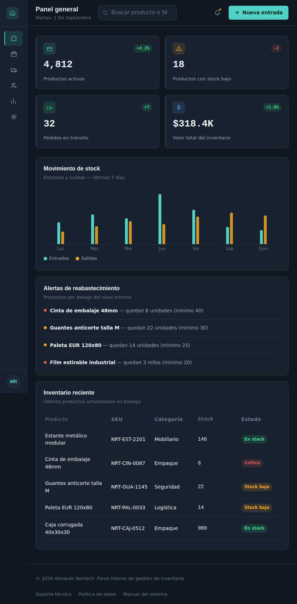

# Almacén Nortech - Dashboard de inventario

Este proyecto es un dashboard (panel administrativo) para gestionar el inventario de un almacén. Lo hice como práctica de HTML, CSS y un poco de JavaScript, enfocándome sobre todo en CSS Grid y Flexbox.

La idea es simular el panel de una persona que administra un almacén: puede ver cuántos productos tiene, cuáles están por agotarse, cuántos pedidos hay en camino, y una tabla con el inventario reciente.

## Demo en vivo

https://ze3aa.github.io/Almacen/

Capturas de pantalla

Están todas en la carpeta `/evidencias`. Dejo algunas acá para que se vean directo en el README.

PC

PC con el menú lateral colapsado

Tablet

CELULAR

CElULAR con el menú abierto

Qué usé?

- HTML5 
- CSS3
  - CSS Grid para armar la estructura general (sidebar, header, contenido, footer)
  - Flexbox para acomodar las cosas dentro de cada sección (las tarjetas, los links del menú, las filas de la tabla)
  - Variables CSS para no repetir colores y tamaños por todos lados
  - Media queries para que se vea bien en celular y tablet
- JavaScript (vanilla, sin librerías) para:
  - Colapsar y expandir el menú lateral
  - Abrir/cerrar el menú en la versión móvil
  - Poner la fecha actual automáticamente

No usé ningún framework
Estructura del dashboard

- **Sidebar**: el menú de navegación (Panel general, Inventario, Pedidos, Proveedores, Reportes, Configuración). Se puede colapsar para dejar solo los íconos.
- **Header**: tiene el buscador, notificaciones y un botón para agregar una nueva entrada al inventario.
- **Tarjetas de resumen**: 4 tarjetas arriba con los números más importantes (productos activos, stock bajo, pedidos en tránsito, valor total).
- **Gráfico**: un gráfico de barras simple hecho solo con CSS (divs con Flexbox), que muestra entradas y salidas de la última semana.
- **Alertas**: lista de productos que están por debajo del stock mínimo.
- **Tabla de inventario**: los productos más recientes, con su SKU, categoría, stock y estado.
- **Footer**: info básica y algunos links.

 Por qué elegí estos colores y esta tipografía

Quería que se viera como un panel "de control", algo más técnico y oscuro, no el típico dashboard blanco con tarjetas redondeadas que se ve en todos lados. Por eso el fondo es azul oscuro casi negro.

Los colores sí tienen un propósito, no son solo decoración:
- Verde agua: para las acciones principales
- Ámbar/naranja: para las advertencias (como el color de precaución en un almacén real)
- Rojo: para lo urgente/crítico (por ejemplo cuando un producto está en stock crítico)
- Verde: para cuando algo está bien / en stock

Para la tipografía usé una fuente para los títulos y otra para el texto normal, y una fuente monoespaciada para los números y los códigos SKU, para que se alineen mejor en la tabla (como en un sistema real de inventario).

Cómo lo hice responsive

Puse dos media queries:

- Hasta 1024px (tablet): el menú lateral se achica y solo se ven los íconos, y las 4 tarjetas de resumen pasan a mostrarse en 2 columnas en vez de 4.
- Hasta 640px (celular): el menú lateral desaparece completamente y se reemplaza por un botón de hamburguesa arriba que lo abre como un menú deslizante. La tabla de inventario también cambia: en vez de columnas se convierte en una lista de tarjetas, porque en pantallas chicas una tabla normal no se ve bien (obliga a hacer scroll horizontal).

## Accesibilidad

Traté de seguir buenas prácticas básicas de accesibilidad:

- Usé roles ARIA en las secciones principales (navigation, main, banner, contentinfo)
- Agregué un link de "saltar al contenido principal" para quien navega con teclado
- Los botones de solo ícono (como el de notificaciones o el de abrir el menú) tienen un `aria-label` explicando qué hacen
- Todos los elementos interactivos (links, botones, el buscador) tienen un estado de foco visible cuando se navega con teclado (tab)
- La imagen del avatar tiene su `alt`
- Los íconos que son solo decorativos (y ya tienen un texto al lado explicando qué son) están marcados como `aria-hidden` para no generar ruido a quien usa lector de pantalla
- Revisé que el contraste entre el texto y el fondo fuera legible
